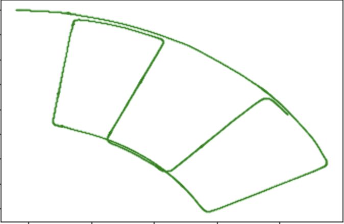
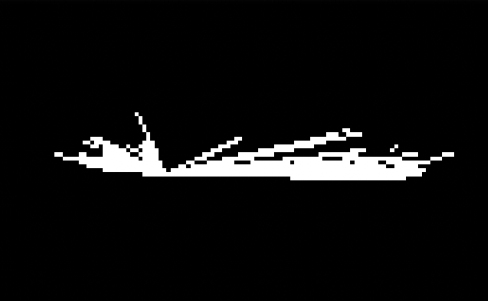
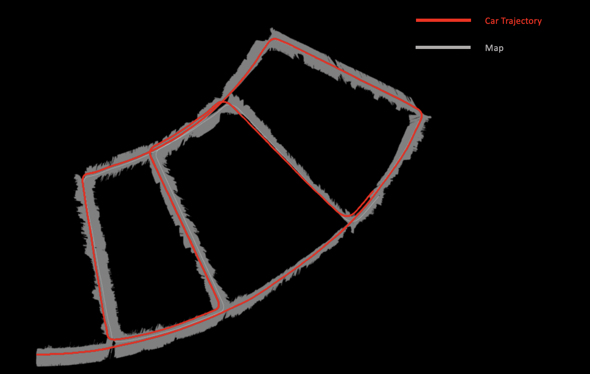
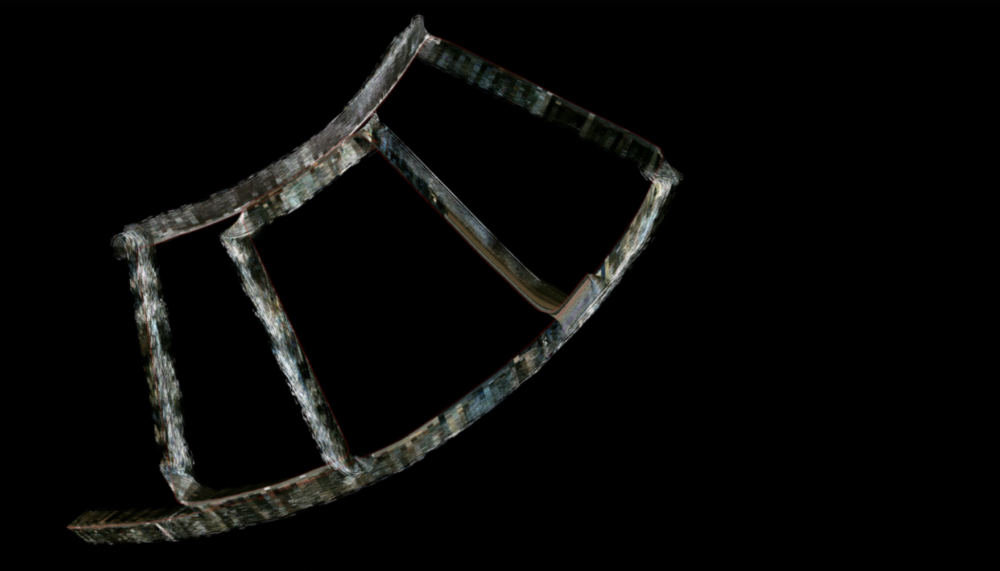

# Particle Filter SLAM

### This folder contains source file for the Project 2 of ECE276A WI22. 

Note: Data for the project is to be downloaded from links mentioned in ECE276A_PR2.pdf

Please ensure that the "data" folder is added at the root location and not inside the "code" folder.

### High level organization:
|--code
|------/src (Folder containing the source code)
|------/data (Unused)
|--data (Add param, stereo_images and sensor_data folders here)
|--cam\_utils
|--Readme.md
|--Images
|------/FirstLidar.png
|------/FinalSLAM.png
|------/TextureMap.png
|------/DeadRekon.jpg
|------/MappingGif.gif

### Source Code Organization:
- code/src/mapping.py - Contains Map generation class. Map log odds are updated in this class
- code/src/update.py - Contains class for the Update step of the particle filter SLAM
- code/src/prediction.py - Contains class for the Prediction step of the particle filter SLAM. Contains differential drive motion model source code
- code/src/texture.py - Contains class and functions to perform texture mapping
- code/src/run_slam.py - Entry point for the codebase. Loops through the input sensor data and performs SLAM operations. Hook functions are provided in this file to access function from mapping, update, texture mapping and prediction classes.
- code/src/parameters.py - Class containing look up tables for parameters of the sensors used
- code/requirements.txt - List of necessary libraries
- code/pr2_utils.py - Contains utility functions such as compute_stereo(), mapCorrelation(), bresenham2D()

Note: src folder contains empty "map", "map_gray" and "texturemap" folders. These are the folders in which intermediate maps and trajectories are stored. Generated images are removed to prevent size blow up and only the relevant images are added in /Images/ folder.

Texture Mapping requires the disparity maps to be created beforehand and stored at "data/stereo_images/disparity" folder. Function to create this disparity map folder is added in pr2_utils.py folder. I have created cam_time.csv file and provided the csv in cam_utils folder which helps in picking the right disparity image. 

### Creating disparity image:
Run pr2_utils.py file with main function as provided in the file.

### Instructions for running the code:

- Install the libraries are mentioned in the requirements.txt
- Run "run_slam.py" script to perform SLAM
- To run dead reckoning, set self.dead_reckon = True in Particle_Filter_SLAM() class of run_slam.py

Folder also contains map_parameters.pkl with values saved in "[map_result, texture_map, xis, yis, mu, weights]" format. Reading the pkl file and plotting xis and yis will show the trajectory.

Please note that the Particle Filter SLAM Output and Texture Mapping Output images shown below are inverted along Y-axis

## Output Images:

### Dead Reckoning:

### First Lidar Scan Output:

### Particle Filter SLAM Output:

### Texture Mapping Output:

